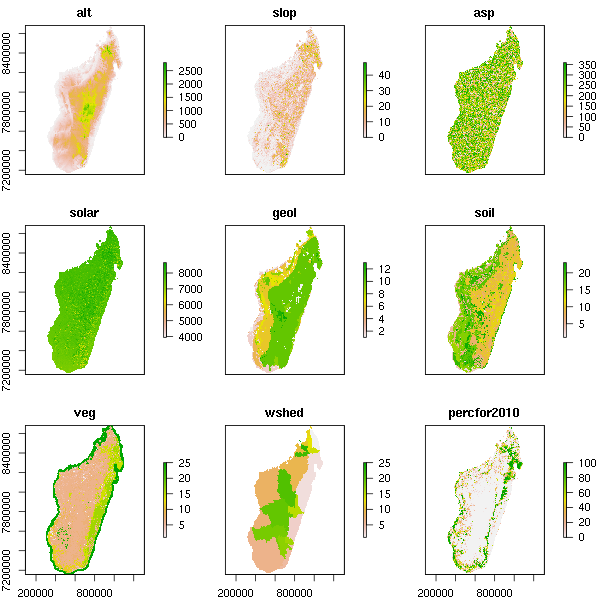

# madaclim

## GitHub repository

This repository includes the R/GRASS scripts and data used for computing climatic and environmental layers for Madagascar. The final products are available at the [MadaClim.org](http://madaclim.org) website.

## MadaClim.org

The [MadaClim.org](http://madaclim.org) website is a product of the [BioSceneMada](http://bioscenemada.net) project leaded by a consortium of scientific institutes from Madagascar and France (Cirad, ETC Terra, ONE and WCS) and funded by FRB-FFEM. The objective of MadaClim is to be an equivalent to [WorldClim](http://www.worldclim.org) but focused on Madagascar and offering additional climatic and environmental data.

## Content

MadaClim provides a set of climate layers (grids) obtained from [WorldClim](http://www.worldclim.org) and the [CGIAR CCAFS](http://www.ccafs-climate.org/data/) climate data portal. Additional climate layers are provided such as **potential evapotranspiration** from the Thornthwaite equation, **climatic water deficit** and **number of dry months**. Some other environmental layers such as altitude, solar radiation, geology, soil and vegetation are also available.

Climate data are available for **current conditions** (interpolations of observed data, representative of 1950-2000), **future conditions**: downscaled global climate model (GCM) data from CMIP5 (IPPC Fifth Assessment) and **past conditions** (downscaled global climate model output).

Layers have been reprojected (WGS 84 / UTM zone 38, epsg: 32738) and data resampled at 1km on an extent covering Madagascar (W: 298000, S: 7155000, E:1101000, N: 8683000). 

### Example: potential evapotranspiration

Figure 1: Current monthly potential evapotranspiration (mm).

### Example: environmental variables

Figure 2: Environmental variables for Madagascar.